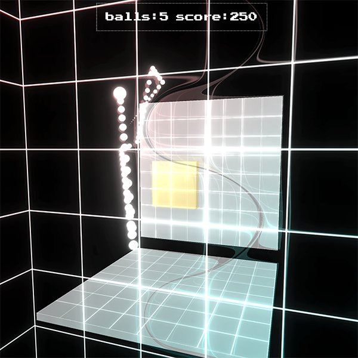

# Pong in THREEjs

  I'm making pong / tron disc's in three js - lets see how this goes.
##

## TBD More to come

  The entry point is ```index.js``` --> ```app.js``` which is an example of a class Render, which is attached

## Run the example
  Requires Node and Yarn to be installed for build and development.

  *Open a terminal window and type the following for local webpack dev server...*
  ```bash
  $ yarn install
  $ yarn dev
  ```
  open http://localhost:2020


